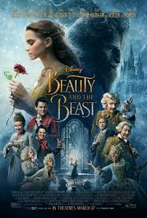

# NetFlix_Clone
## Date: 09/07/2025
## Objective:
To create a modern, responsive navigation bar using CSS Flexbox, mimicking real-world websites like Netflix. This helps reinforce alignment, spacing, and layout structuring using Flexbox properties.

## Tasks:

#### 1. Structure the HTML Layout:
Use a ```<nav>``` tag as the main container.

Add a brand logo/title on the left using a ```<div> or <h1>```.

Add navigation links like Home, Menu, About, Contact, and Login using a ```<ul> with <li> and <a>```.

#### 2. Apply Flexbox for Layout:
Use display: flex on the ```<nav>``` container.

Use justify-content: space-between to align the logo and menu.

Use align-items: center to vertically center both sections.

Style list items with horizontal spacing using gap or margin.

#### 3. Style Like a Real-World Navbar:
Add background color (e.g., dark or gradient like Netflix/Zomato).

Style text with bold fonts, hover effects, and link styling.

Remove default ul and li styles (list-style: none, text-decoration: none).

#### 4. Bonus Enhancements:
Add a hover underline or button effect on links.

Make it responsive using flex-wrap or media queries.

Fix the nav bar to top with position: sticky.
## HTML Code:
```
<!DOCTYPE html>
<html lang="en">
<head>
    <meta charset="UTF-8">
    <meta name="viewport" content="width=device-width, initial-scale=1.0">
    <title>Netflix Clone</title>
    <link rel="stylesheet" href="styles.css">
</head>
<body>
    <header class="navbar">
        <div class="logo">
            <a href="#">Netflix</a>
        </div>
        <div class="nav-links">
            <a href="#">Home</a>
            <a href="#">TV Shows</a>
            <a href="#">Movies</a>
            <a href="#">Latest</a>
            <a href="#">My List</a>
        </div>
        <div class="profile">
            <a href="#">Profile</a>
        </div>
    </header>

    <section class="banner">
        <div class="banner-content">
            <h1>Watch Your Favorite Movies & TV Shows</h1>
            <button>Play</button>
            <button>My List</button>
        </div>
    </section>

    <section class="movie-section">
        <h2>Trending Now</h2>
        <div class="movie-list">
            <div class="movie-card">
            </div>
            <div class="movie-card">
            </div>
            <div class="movie-card">
                
            </div>
        </div>
    </section>

    <section class="movie-section">
        <h2>Top Picks for You</h2>
        <div class="movie-list">
            <div class="movie-card">
                
            </div>
            <div class="movie-card">
                
            </div>
            <div class="movie-card">
                
            </div>
        </div>
    </section>

    <footer class="footer">
        <p>© 2025 Netflix Clone. All rights reserved.</p>
    </footer>
</body>
</html>

```
## CSS Code:
```
* {
    margin: 0;
    padding: 0;
    box-sizing: border-box;
}

body {
    font-family: Arial, sans-serif;
    background-color: #141414;
    color: white;
}

.navbar {
    display: flex;
    justify-content: space-between;
    padding: 20px;
    background-color: #111;
}

.navbar .logo a {
    font-size: 2em;
    font-weight: bold;
    color: white;
    text-decoration: none;
}

.navbar .nav-links a {
    margin: 0 15px;
    color: white;
    text-decoration: none;
}

.navbar .profile a {
    color: white;
    text-decoration: none;
}

.banner {
    background: url('netflix_background.jpg') no-repeat center center/cover;
    height: 400px;
    display: flex;
    justify-content: center;
    align-items: center;
    text-align: center;
}

.banner-content h1 {
    font-size: 3em;
    margin-bottom: 20px;
}

.banner-content button {
    background-color: #e50914;
    color: white;
    padding: 10px 20px;
    border: none;
    font-size: 1.2em;
    cursor: pointer;
    margin: 5px;
}

.banner-content button:hover {
    background-color: #f40612;
}

.movie-section {
    margin: 20px 0;
}

.movie-section h2 {
    font-size: 1.8em;
    margin-left: 20px;
    margin-bottom: 10px;
}

.movie-list {
    display: flex;
    overflow-x: scroll;
    padding: 10px;
}

.movie-card {
    background-color: #333;
    width: 200px;
    height: 300px;
    margin-right: 10px;
    border-radius: 8px;
    background-size: cover;
    background-position: center;
}

.movie-card:hover {
    transform: scale(1.05);
    transition: transform 0.3s;
}

.footer {
    text-align: center;
    padding: 20px;
    background-color: #111;
}

.footer p {
    font-size: 1em;
}
```
## Output:


## Result:
A modern, responsive navigation bar using CSS Flexbox, mimicking real-world websites like Netflix. This helps reinforce alignment, spacing, and layout structuring using Flexbox properties is created successfully.
